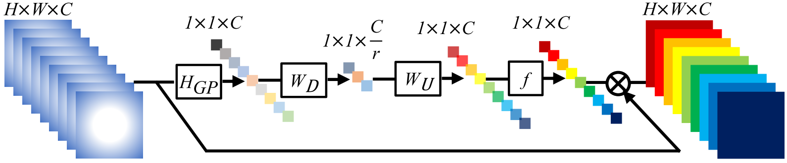
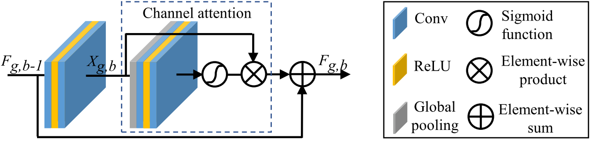
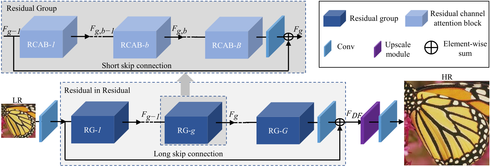

# RCAN TEST

iThis repository is for RCAN introduced in the following paper:
Yulun Zhang, Kunpeng Li, Kai Li, Lichen Wang, Bineng Zhong, and Yun Fu, "Image Super-Resolution Using Very Deep Residual Channel Attention Networks", ECCV 2018, [[arXiv]][1]
source link: https://github.com/yulunzhang/RCAN

## introduction

Convolutional neural network (CNN) depth is of crucial importance for image super-resolution (SR). However, we observe that deeper networks for image SR are more difficult to train. The low-resolution inputs and features contain abundant low-frequency information, which is treated equally across channels, hence hindering the representational ability of CNNs. To solve these problems, we propose the very deep residual channel attention networks (RCAN). Specifically, we propose a residual in residual (RIR) structure to form very deep network, which consists of several residual groups with long skip connections. Each residual group contains some residual blocks with short skip connections. Meanwhile, RIR allows abundant low-frequency information to be bypassed through multiple skip connections, making the main network focus on learning high-frequency information. Furthermore, we propose a channel attention mechanism to adaptively rescale channel-wise features by considering interdependencies among channels. Extensive experiments show that our RCAN achieves better accuracy and visual improvements against state-of-the-art methods.


Channel attention (CA) architecture.


Residual channel attention block (RCAB) architecture.


The architecture of our proposed residual channel attention network (RCAN).

## dataset
```
RCAN_datasets
└── DIV2K
    ├── DIV2K_train_HR
    ├── DIV2K_train_LR_bicubic
    ├── DIV2K_valid_HR
    └── DIV2K_valid_LR_bicubic
```

## checkpoint
```
models_ECCV2018RCAN/RCAN_BIX2.pt
```

## dependence
```
torch
torch_ipex
pip install torchvision==0.6.0 --no-deps
pip install imageio matplotlib tqdm scikit-image
pip install scipy==1.1.0
```

## test
```
# inference
cd RCAN_TrainCode/code
bash run_dpcpp.sh

# test
cd RCAN_TestCode/code
bash run_dpcpp.sh
```

## Demo

### input Pic 360 * 640

### output Pic 720 * 1280


[1]: https://arxiv.org/abs/1807.02758